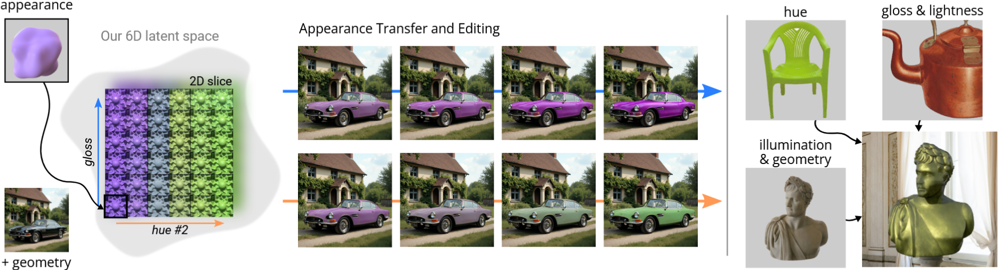
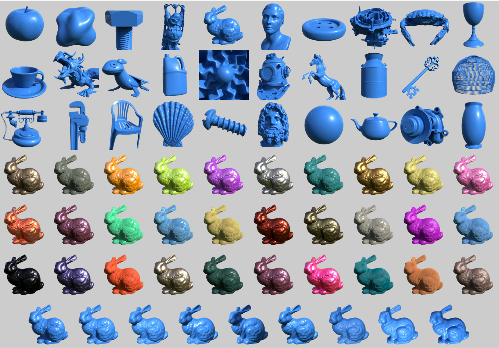

# A Controllable Appearance Representation for Flexible Transfer and Editing

[](https://graphics.unizar.es/projects/mat_disentanglement_2025/) [](https://arxiv.org/pdf/2504.15028)  [](https://nas-graphics.unizar.es/s/ZRCZfbEzw5Ba3p3)  [](https://huggingface.co/datasets/SantiagoJN/mat_disent)


The official implementation of [**A Controllable Appearance Representation for Flexible Transfer and Editing**](https://graphics.unizar.es/projects/mat_disentanglement_2025/). 

[Santiago Jimenez-Navarro](https://santiagojn.github.io/), [Julia Guerrero-Viu](https://webdiis.unizar.es/~juliagv/), [Belen Masia](http://webdiis.unizar.es/~bmasia/)

Universidad de Zaragoza, I3A, Spain, 


In **EGSR 2025** (Oral Presentation)



## Organization of the Repository

Our code is subdivided in two modules, as explained in the paper:

 - **FactorVAE**, the generative model that learns a latent space *Z*.
 - **IP adapter**, the light-weight adapter that leverages the *Z* space for conditioning a diffusion-based pipeline, effectively tuning with the factors learned automatically in such space.

Each of these modules can be found in their respective folders inside this repository. These repositories are based on existing works (see [Acknowledgements](#acknowledgements) section), to which we applied certain adaptations and extended their functionality to match our needs.

## Models and Dataset

We shared the pretrained models and dataset used in our paper, in order to allow reproduction of results and facilitate future research in this line. Such models can be found [here](https://nas-graphics.unizar.es/s/ZRCZfbEzw5Ba3p3), and the dataset (98,550 samples resulting from the combination of 30 geometries x 365 measured materials x 9 lighting conditions) can be found [here](https://huggingface.co/datasets/SantiagoJN/mat_disent). The later looks something like this: 




## Training Scripts

We share here the scripts used to trained the checkpoints shared above. Prior to running these trainings, make sure you have configured the necessary paths and downloaded the published datasets.

### FactorVAE Model
With an environment containing the necessary packages, please run
```
python main.py 
	test 
	-r smooth 
	-d datasetwnormals 
	--train_folder new_dataset 
	-l factor 
	--lr 0.0007 
	--lr-disc 0.00007 
	-b 150 
	-e 2400 
	-z 6 
	--checkpoint-every 300 
	--use-normals 
	--skip 2 
	--warmup-epochs 1000 
	--max-beta 2 
	--kl_func 3 
	-t precomputed_triplets_new_ds_v2_utias 
	--CIELAB 
	-s 108
```

### IP-Adapter model
You can train the light-weight adapter with the following command

```
accelerate launch tutorial_train_sdxl.py 
	--pretrained_model_name_or_path="your_path/RealVisXL_V4.0" 
	--image_encoder_path="your_path/image_encoders/test_architecture_57_108_2.4k" 
	--data_json_file="datasets/new_dataset_v2.2/ds.json" 
	--data_root_path="datasets/new_dataset_v2.2/data" 
	--mixed_precision="bf16" 
	--resolution=256 
	--train_batch_size=10 
	--dataloader_num_workers=10 
	--learning_rate=0.0004 
	--weight_decay=0.01 
	--output_dir="results/output" 
	--num_train_epochs 500 
	--save_steps=50000 
	--CIELAB 
	--denoising_imgs_extension="_black"
```

## Notebooks

We share the notebook we used to get inference results from the diffusion-based pipeline in the file `ip_adapter_multiXL.ipynb`. Feel free to use or modify it to generate your desired images

## Cite

If you use this work, please consider citing our paper with the following Bibtex code:

```
@inproceedings{10.2312:sr.20251187,
	booktitle = {Eurographics Symposium on Rendering},
	editor = {Wang, Beibei and Wilkie, Alexander},
	title = {{A Controllable Appearance Representation for Flexible Transfer and Editing}},
	author = {Jimenez-Navarro, Santiago and Guerrero-Viu, Julia and Masia, Belen},
	year = {2025},
	publisher = {The Eurographics Association},
	ISSN = {1727-3463},
	ISBN = {978-3-03868-292-9},
	DOI = {10.2312/sr.20251187}
}
```

## Acknowledgements

This code refers to the following two great projects. Please refer to them for additional details on how to properly configure the setups used in our work:

[1] [disentangling-VAE](https://github.com/YannDubs/disentangling-vae)

[2] [IP-Adapter](https://github.com/tencent-ailab/IP-Adapter) 

This work has been partially supported by grant PID2022-141539NBI00, funded by MICIU/AEI/10.13039/501100011033 and by ERDF, EU, and by the European Union’s Horizon 2020
research and innovation programme under the Marie Skłodowska-Curie grant agreement No. 956585 (PRIME). Julia Guerrero-Viu was also partially supported by the FPU20/02340 predoctoral grant.
We thank Daniel Martin for his help designing the final figures, Daniel Subias for proofreading the manuscript, and the members of the Graphics and Imaging Lab for insightful discussions. We also thank the people who participated in the user study, and the I3A (Aragon Institute of Engineering Research) for the use of its HPC
cluster HERMES.


## Contact

    s.jimenez@unizar.es (Santiago Jimenez-Navarro)

### Disclaimer:
The code from this repository is from a research project, under active development. Please use it with caution and contact us if you encounter any issue.

## License

This software is under GNU General Public License Version 3 (GPLv3), please see GNU License
For commercial purposes, please contact the authors.
